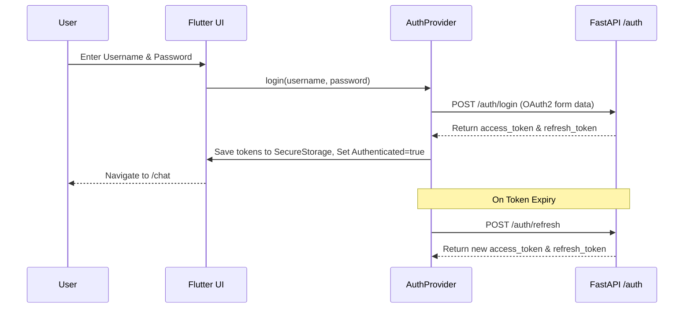

# Authentication Flow

```mermaid
sequenceDiagram
    participant User
    participant Flutter UI
    participant AuthProvider
    participant FastAPI /auth

    User->>Flutter UI: Enter Username & Password
    Flutter UI->>AuthProvider: login(username, password)
    AuthProvider->>FastAPI /auth: POST /auth/login (OAuth2 form data)
    FastAPI /auth-->>AuthProvider: Return access_token & refresh_token
    AuthProvider->>Flutter UI: Save tokens to SecureStorage, Set Authenticated=true
    Flutter UI-->>User: Navigate to /chat
    
    note over AuthProvider,FastAPI /auth: On Token Expiry
    AuthProvider->>FastAPI /auth: POST /auth/refresh
    FastAPI /auth-->>AuthProvider: Return new access_token & refresh_token
```
