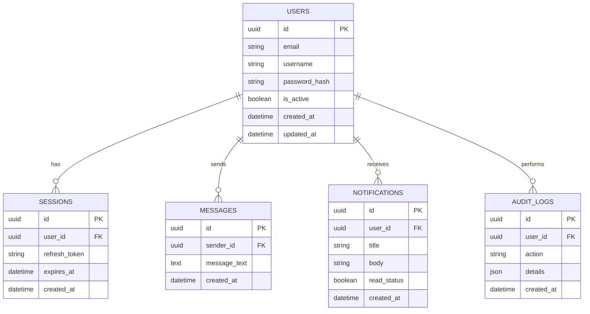

# Database Schema

```mermaid
erDiagram
    USERS {
        uuid id PK
        string email
        string username
        string password_hash
        boolean is_active
        datetime created_at
        datetime updated_at
    }
    SESSIONS {
        uuid id PK
        uuid user_id FK
        string refresh_token
        datetime expires_at
        datetime created_at
    }
    MESSAGES {
        uuid id PK
        uuid sender_id FK
        text message_text
        datetime created_at
    }
    NOTIFICATIONS {
        uuid id PK
        uuid user_id FK
        string title
        string body
        boolean read_status
        datetime created_at
    }
    AUDIT_LOGS {
        uuid id PK
        uuid user_id FK
        string action
        json details
        datetime created_at
    }

    USERS ||--o{ SESSIONS : "has"
    USERS ||--o{ MESSAGES : "sends"
    USERS ||--o{ NOTIFICATIONS : "receives"
    USERS ||--o{ AUDIT_LOGS : "performs"
```
