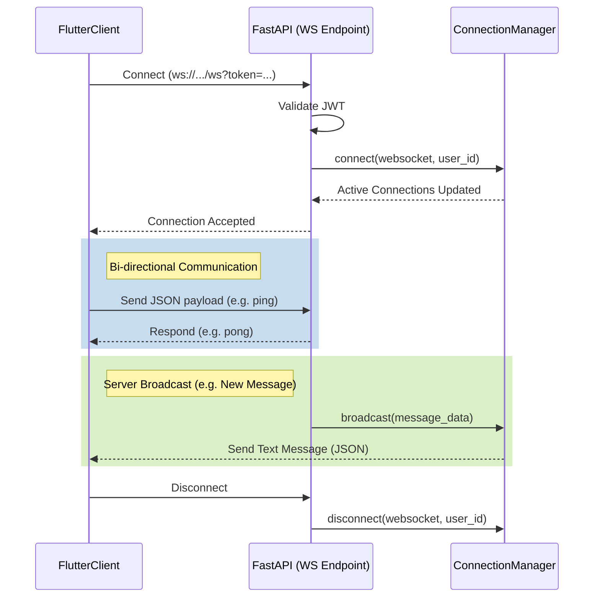

# WebSocket Architecture

```mermaid
sequenceDiagram
    participant FlutterClient
    participant FastAPI (WS Endpoint)
    participant ConnectionManager
    
    FlutterClient->>FastAPI (WS Endpoint): Connect (ws://.../ws?token=...)
    FastAPI (WS Endpoint)->>FastAPI (WS Endpoint): Validate JWT
    FastAPI (WS Endpoint)->>ConnectionManager: connect(websocket, user_id)
    ConnectionManager-->>FastAPI (WS Endpoint): Active Connections Updated
    FastAPI (WS Endpoint)-->>FlutterClient: Connection Accepted
    
    rect rgb(200, 220, 240)
        note right of FlutterClient: Bi-directional Communication
        FlutterClient->>FastAPI (WS Endpoint): Send JSON payload (e.g. ping)
        FastAPI (WS Endpoint)-->>FlutterClient: Respond (e.g. pong)
    end
    
    rect rgb(220, 240, 200)
        note left of FastAPI (WS Endpoint): Server Broadcast (e.g. New Message)
        FastAPI (WS Endpoint)->>ConnectionManager: broadcast(message_data)
        ConnectionManager-->>FlutterClient: Send Text Message (JSON)
    end
    
    FlutterClient->>FastAPI (WS Endpoint): Disconnect
    FastAPI (WS Endpoint)->>ConnectionManager: disconnect(websocket, user_id)
```
